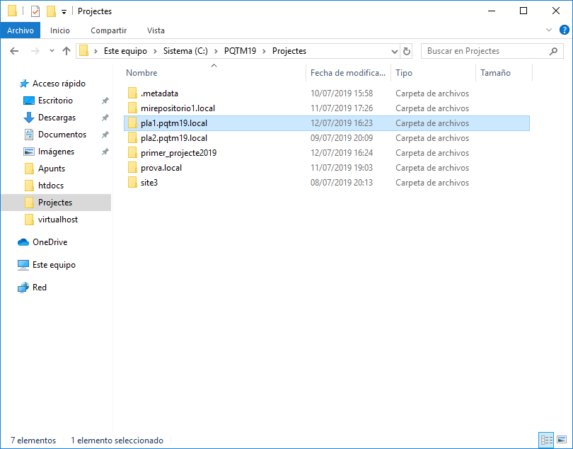

# _ Configuració entorn en desenvolupament Web _
---
## _Introducció_

| LLista del contingut del document |

|:------------------------------------:|

| 1.Instal·lació Xampp |

|2.Configuració Virtual Host d'Apache|

|3.Instal·lació de Eclipse|

|4.Definició de WorkSpace|

|5.Definició de Projecte|

|6.Definició de Repositori local|

|7.Creació de Repositori de GitHub|

|8.Exportació de la branca "master" local sobre repositori GitHub|

###  1.Instal·lació Xampp

  

 el primer pas que hem de fer és anar a la pàgina de Xampp i fer la descàrrega  
 
  
  
una vegada l'hem descarregat toca **obrir** l'arxiu executable  

  

veurem un missatge d'avís, cliquem endavant

  

comença el SETUP!

  

instal·lem per defecte les opcions que ens dóna..

  

**IMPORTANT:** tenir ben ubicat l'arxiu Xampp

  

desmarquem la pestanya de lectura (ja ho mirarem més endavant ;)

  

preparats per la instal·lació en 3,2,1..

  

instal·lant, ja ho tenim

  

ara toca el Panel de control

  

En anglès si no volem apendre alemany (proper capítol)

  

marquem les caselles de Apache i MySQL perquè comencin a treballar...

com podem veure, tot funciona correctament amb els ports oberts "escoltant"

  

### 2.Configuració Virtual Host d'Apache

Anem a crear la carpeta on  volem el **directori Arrel**:  

  

### 3.Instal·lació de Eclipse

### 4.Definició de WorkSpace

### 5.Definició de Projecte

### 6.Definició de Repositori local

### 7.Creació de Repositori de GitHub

### 8.Exportació de la branca "master" local sobre repositori GitHub