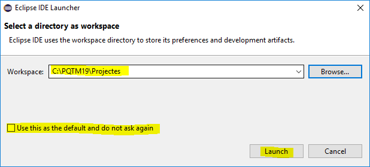

# _ Configuració entorn en desenvolupament Web _
---
## _Introducció_

| LLista del contingut del document |

|:------------------------------------:|

| 1.Instal·lació Xampp |

|2.Configuració Virtual Host d'Apache|

|3.Instal·lació de Eclipse|

|4.Definició de WorkSpace|

|5.Definició de Projecte|

|6.Definició de Repositori local|

|7.Creació de Repositori de GitHub|

|8.Exportació de la branca "master" local sobre repositori GitHub|

###  1.Instal·lació Xampp

  

 el primer pas que hem de fer és anar a la pàgina de Xampp i fer la descàrrega  
 
  
  
una vegada l'hem descarregat toca **obrir** l'arxiu executable  

  

veurem un missatge d'avís, cliquem endavant

  

comença el SETUP!

  

instal·lem per defecte les opcions que ens dóna..

  

**IMPORTANT:** tenir ben ubicat l'arxiu Xampp

  

desmarquem la pestanya de lectura (ja ho mirarem més endavant ;)

  

preparats per la instal·lació en 3,2,1..

  

instal·lant, ja ho tenim

  

ara toca el Panel de control

  

En anglès si no volem apendre alemany (proper capítol)

  

marquem les caselles de Apache i MySQL perquè comencin a treballar...

com podem veure, tot funciona correctament amb els ports oberts "escoltant"

  

### 2.Configuració Virtual Host d'Apache

Anem a crear la carpeta on  volem el **directori Arrel**:  

   

ara haurem d'anar al directori http.vhosts.config per crear el servidor virtual:

    

L'editem amb click dret i el Notepadd++

  

Hem marcat amb color groc les linees a modificar (recordem l'arxiu creat anteriorment)    

  

Aprofitem un Virtual Host que teniem anteriorment creat i modifiquem el directori corresponent    

  

ens falta definir la dir-li al nostre servidor com es dira la pàgina:    

  

En la següent imatge ens salta l'avís de que hem de modificar-ho com administrador, sense cap problema..    

  

Per comprovar que tot funciona primerament hem de reiniciar el Apache    

  

Ja està reiniciat i sembla que de moment funciona (el Apache i el MySQL estan escoltant així que bona senyal)    

  

entrem a la nostra pàgina web i...    

   

>>ja la tenim!!!!

### 3.Instal·lació de Eclipse

Lo primer és instal·lar el programa _Eclipse_:

  
  
descarreguem la versió 64 bit
  
  

Cliquem a Download:  

  

Esperem a descarregar-ho i obrim l'arxiu executable  

  

És necessari que descarreguem l'arxiu de Java ja que treballen junts els dos programes:  

  

Acceptem llicencia i endavant!  

  

Ja el tenim descarregat i ara es quan toca executar-ho  

  

Comencem amb l'instal·lador fent Next:  

  

La ubicació de l'arxiu per defecte és correcte  

  

  

i acabem tancant una vegada descarregats tots els arxius 

  

S'obre el programa i escollim l'opció de PHP (com veiem hi ha de tot tipus)  

  
  

**ALERTA:**  **instal·lar l'Eclipse al Directori on tenim els projectes que volem crear i modificar per no tenir que dir-li en tot moment la ruta on buscar-los**

  

Acceptem les condicions que ens ofereix el programa  

  

i Instal·lem..  

  

  

  

Ara només hem de Iniciar l'Eclipse:    

  

  

i acabem **definint** el Espai de Treball de Eclipse:  

### 4.Definició de WorkSpace

El workspace es la carpeta on es guardaran tots els arxius que generi Eclipse, tant codi font como codi compilat i codi del propi Eclipse.

  

### 5.Definició de Projecte  

  

Escollim un Projecte General  

   

Aqui posarem el nom del projecte a definir (posarem el mateix que la futura pàgina web) 

  

  

### 6.Definició de Repositori local  

Per definir el repositori local primer farem buscarem la pestanya marcada a la imatge:  

  

Farem click al contenidor + per crear un nou  

  

  

escollim el nom del projecte en questió   

  

Comprovem com ha funcionat:  

  

  

important esborrar l'arxiu per defecte que ens crea el Git ja que no ens interessa un nou projecte fet per Git  

   
  

  

### 7.Creació de Repositori de GitHub

  

Creem el nou repositori al GitHub amb el nom del nostre projecte local  

  

i copiem la direcció URI per després poder-ho pujar del nostre projecte local al projecte GitHub

   

   

 

   

### 8.Exportació de la branca "master" local sobre repositori GitHub  

En el nostre repositori local fem un Push a la branca principal (ja que no tenim cap branca secundaria)

  

enganxem la nostra URI (CTRL + V)   

  

Rèplica feta!!!   

   
